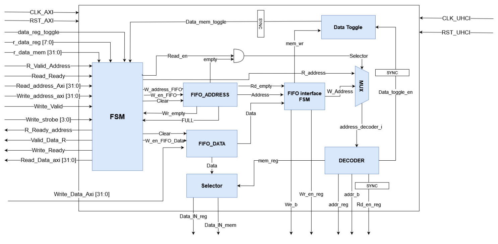

# USB_AXI_interface
The AXI interface module allows for communication between the AXI core and the memory 
and register file of the USB. The data and valid signals are received from the AXI core and 
then sent to the appropriate address locations in the USB memory and register file.

 ### AXI_Interface Block Diagram:

